# Creating an Object Template for a Container
## Demo Duration
This demo will take 15 minutes to complete.

## Demo Objective

In this demo, you create an object template from a container that includes other objects.

## Open an Existing Report

1. On the desktop, double-click the **SAS Visual Analytics** icon.
1. Enter the following:
    - User ID:  ***Designer***
    - Password: ***Student1*** (where 1 is the number one)
1. Click **Sign in**.

1. In the upper left corner, click the **Applications menu** button and select **Explore and Visualize**, if necessary.
1. Navigate to **SAS Content/Courses/VISUAL** folder.
1. Double-click the **140_101_Creating an Object Template for a Container** report to open it.
1. Verify that you are editing the report.

   ## Examine Options for Key Value Objects

1. On the canvas, click the key value object on the left to select it.
1. In the right pane, click the **Options** button.
1. View the options in the Object group.

    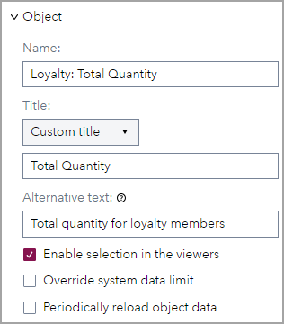

    The object is assigned a more descriptive **Name** and a **Title**. In addition, **Alternative text** was added to the object, which will be announced by screen readers when a user navigates to the object.

1. View the options in the Key Value group.

    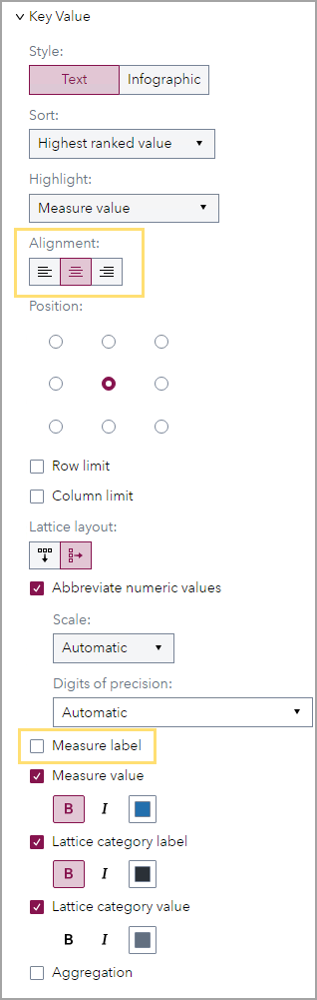

    The **Alignment** of the text was changed to **Center** and the **Measure label** was removed from the key value object.

1. In the right pane, click the **Filters** button.

    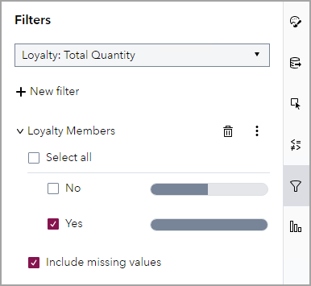

    A common filter is added to the key value object to only display data for customers who are loyalty members.

   ## Examine Options for Bar Charts

1. On the canvas, click the bar chart on the left to select it.
1. In the right pane, click the **Options** button.
1. View the options in the Object group.

    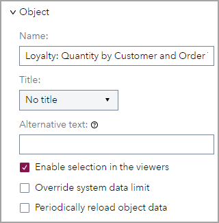

    The object is assigned a more descriptive **Name** and no title.

1. View the options in the Graph Frame group.

    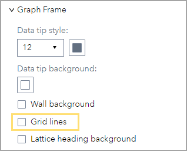

    **Grid lines** were removed from the bar chart.

1. View the options in the Bar group.

    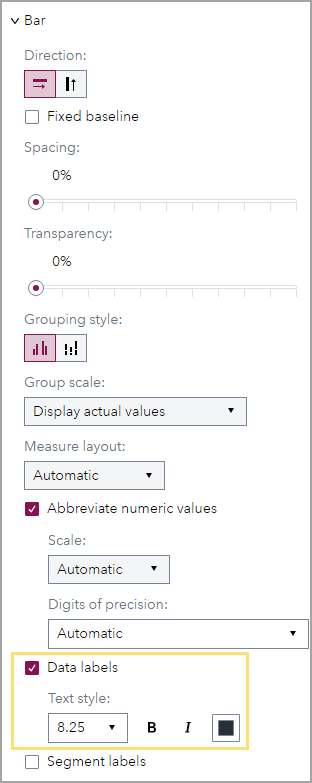

    **Data labels** were added to the bar chart.

1. View the options in the X Axis Options and Y Axis Options groups.

    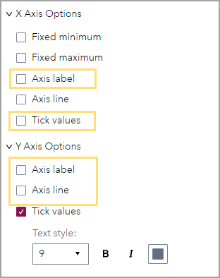

    For the X axis, the **Axis label** and **Tick values** were removed. For the Y axis, the **Axis label** and **Axis line** were removed.

1. In the right pane, click the **Filters** button.

    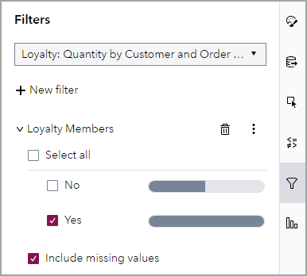

    A common filter is added to the bar chart to only display data for customers who are loyalty members.

1. View the order of bars in the bar chart.

    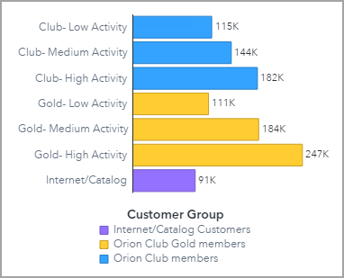

    The bars in the bar chart are sorted using a custom sort, where club members are displayed first (low, medium, and high activity), gold members are displayed next (low, medium, and high activity), and internet/catalog members are displayed last.

   ## Save Container as Object Template

1. In the left pane, click the **Outline** button.

   Using the Outline pane makes it easier to save an object template of a container.

1. Right-click **Standard Container** and select **Save to Objects pane**.
1. In the **Name** field, enter **&nbsp; Customized Loyalty Template** (be sure to add a space before the name so the object template appears first in the object group).
1. Select **Include data**.

    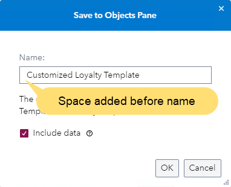

1. Click **OK**.
1. In the left pane, click the **Objects** button, if necessary.
1. Scroll down and view the new group, Objects with Data.

    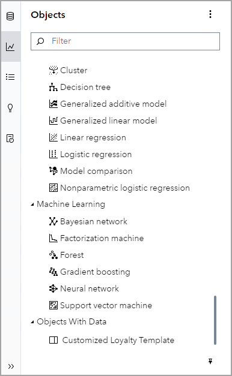

    The object template is added to a new group on the Objects pane.

   ## Use Object Template in New Report

1. In the upper right corner, click the **More** button and select **New**.
1. In the left pane, click the **Objects** button.
1. Drag the **&nbsp; Customized Loyalty Template**, from the Objects with Data group, to the canvas.

    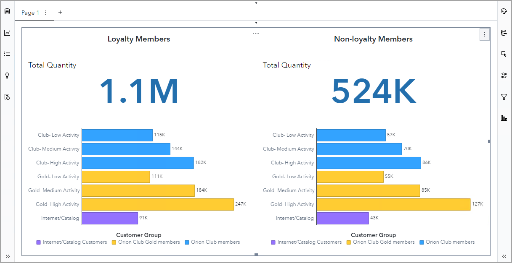

    The container and all  the objects within the container (with all option changes) are added to the report. Notice, the layout of all objects is preserved.

    In addition, because data was saved with the object template, the data source (CUSTOMERS) was added to the report, all filters were included, and the sorting was preserved.

1. In the upper right corner, click the **More** button and select **Close**.
1. Click **Don't save** to not save the report.
