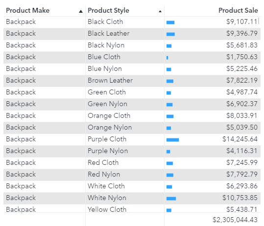
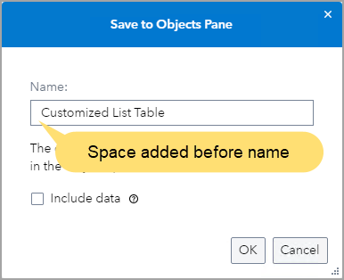
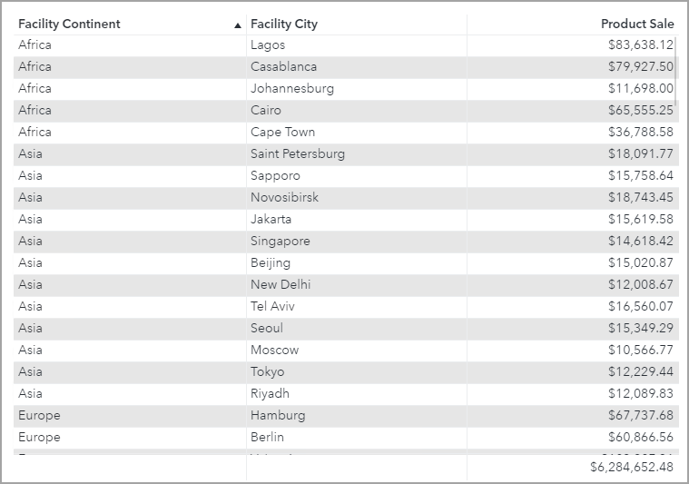
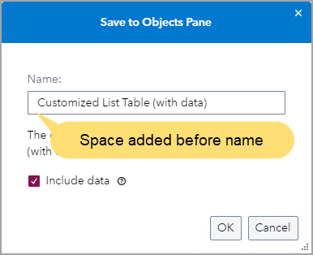
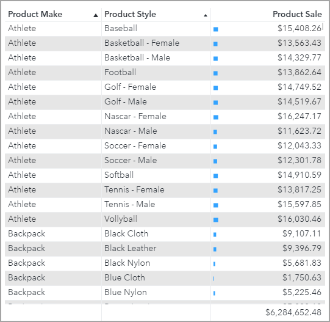

# Saving an Object Template for a Graph
## Practice Duration
This practice will take 15 minutes to complete.

## Practice Objective

In this practice, you will save an object template for a graph.

## Open an Existing Report

1. Open the **140_102_Saving an Object Template for a Graph** report from the **SAS Content/Courses/VISUAL** folder in edit mode.
   

   
Click to expand/collapse for solution

   **Solution:**
   1. On the desktop, double-click the **SAS Visual Analytics** icon.
   1. Enter the following:
      - User ID:  ***Designer***
      - Password: ***Student1*** (where 1 is the number one)
   1. Click **Sign in**.
   1. In the upper left corner, click the **Applications menu** button and select **Explore and Visualize**, if necessary.
   1. Navigate to **SAS Content/Courses/VISUAL** folder.
   1. Double-click the **140_102_Saving an Object Template for a Graph** report to open it.
   1. Verify that you are editing the report.
   

   ## View the List Table

1. On the Product Analysis page, view the list table and answer the following questions:
   - How is the list table sorted?
   - What type of cell visualization is added to the list table? On which column?
   - What is the total for Product Sale?

   

   
Click to expand/collapse for solution

   **Solution:**
   1. Click the **Product Analysis** tab, if necessary.
   1. View the list table on the canvas.

      

      The list table is sorted by Product Make (in ascending order) and then by Product Style (in ascending order).

      A bar cell visualization is added to the Product Sale column.

      The total for Product Sale is $2,305,044.43.
   

   ## Create an Object Template Without Data

1. Create an object template of the list table named **&nbsp;Customized List Table** (be sure to add a space before the name so the object template appears first in the object group). Do *not* include data.

   

   
Click to expand/collapse for solution

   **Solution:**
   1. On the canvas, right-click the list table and select **Save to Objects pane**.
   1. In the **Name** field, enter **&nbsp; Customized List Table** (be sure to add a space before the name).
   1. Verify that **Include data** is *not* selected.

      

   1. Click **OK**.

   

1. Add the **&nbsp;Customized List Table** object to the **Facility Analysis** page and assign the following data items to the specified roles:

   | Role | Data Item |
   | --- | --- |
   | Columns | Facility Continent |
   | | Facility City |
   | | Product Sale |

   Answer the following questions:
   - Is the sort maintained?
   - Does the list table display a cell visualization?
   - Does the list table include totals?

   

   
Click to expand/collapse for solution

   **Solution:**
   1. Click the **Facility Analysis** tab.
   1. In the left pane, click the **Objects** button.
   1. Drag the **Customized List Table** object, from the Tables group, to the canvas.

      The **Customized List Table** object appears in the Tables group because it does not include data.

   1. On the canvas, click the list table to select it, if necessary.
   1. In the right pane, click the **Data Roles** button.
   1. For the **Columns** role, click **Add**.
   1. Select the following columns:
      **Facility Continent**
      **Facility City**
      **Product Sale**
   1. Click **Apply**.

      

      The sort is not maintained for the list table. The list table is only sorted by Facility Continent (in ascending order), which is the default sort for list tables.

      The list table does not display a cell visualization for Product Sale.

      The list table displays totals for Product Sale.

      Because data was not included, any data settings (like roles, sorting, and cell visualizations based on data) are not maintained.

   

   ## Create an Object Template With Data

1. On the Product Analysis page, create an object template of the list table named **Customized List Table (with data)** (be sure to add a space before the name so the object template appears first in the object group). Be sure to include data.

   

   
Click to expand/collapse for solution

   **Solution:**
   1. Click the **Product Analysis** tab.
   1. On the canvas, right-click the list table and select **Save to Objects pane**.
   1. In the **Name** field, enter **Customized List Table (with data)** (be sure to add a space before the name).
   1. Select **Include data**.

      

   1. Click **OK**.
   

1. Add the **Customized List Table (with data)** object on the right side of the **Facility Analysis** page.

   Answer the following questions:
   - Is the sort maintained?
   - Does the list table display a cell visualization?
   - Does the list table include totals?

   

   
Click to expand/collapse for solution

   **Solution:**
   1. Click the **Facility Analysis** tab.
   1. In the left pane, click the **Objects** button.
   1. Drag the **Customized List Table (with data)** object, from the Objects With Data group, to the right side of the canvas.

      The **Customized List Table (with data)** object appears in the Objects With Data group because it does  include data.

      

      The sort is maintained when using the object template with data. The list table is sorted by Product Make (in ascending order) and then by Product Style (in ascending order).

      The list table displayed a bar cell visualization for the Product Sale column.

      The list table displays totals for Product Sale.

      Because data was included, any data settings (like roles, sorting, and cell visualizations based on data) are maintained.

   

1. Save the report.

   

   
Click to expand/collapse for solution

   **Solution:**
   1. In the upper right corner, click the **Save** button to save the report.
   

