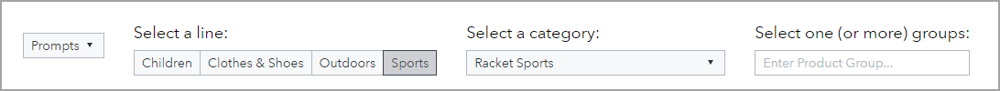
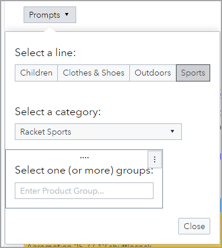
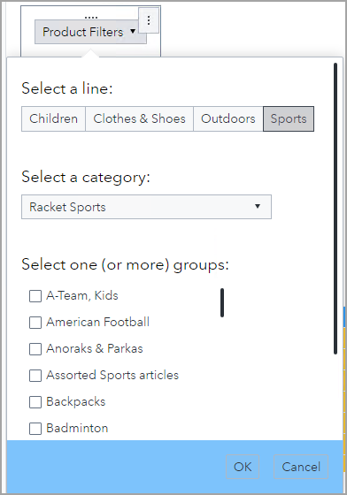
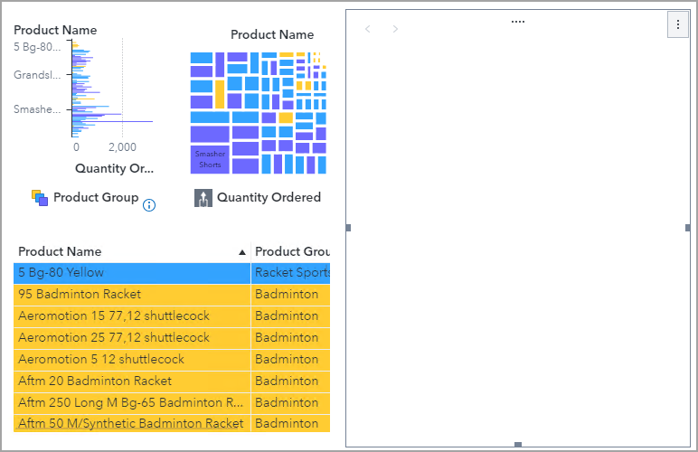
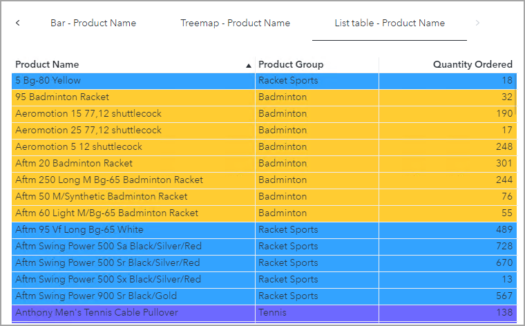

# Using Prompt and Stacking Containers
## Practice Duration
This practice will take 15 minutes to complete.

## Practice Objective

In this practice, you will add a prompt container and a stacking container to a report.

## Open an Existing Report

1. Open the **140_703_Using Prompt and Stacking Containers** report from the **SAS Content/Courses/VISUAL** folder in edit mode.
   

   
Click to expand/collapse for solution

   **Solution:**
   1. On the desktop, double-click the **SAS Visual Analytics** icon.
   1. Enter the following:
      - User ID:  ***Designer***
      - Password: ***Student1*** (where 1 is the number one)
   1. Click **Sign in**.
   1. In the upper left corner, click the **Applications menu** button and select **Explore and Visualize**, if necessary.
   1. Navigate to **SAS Content/Courses/VISUAL** folder.
   1. Double-click the **140_703_Using Prompt and Stacking Containers** report to open it.
   1. Verify that you are editing the report.
   

   ## Add a Prompt Container

1. Add a prompt container to the page prompt area and insert the button bar, drop-down-list control, and text input control into the container.

   

   
Click to expand/collapse for solution

   **Solution:**
   1. In the left pane, click the **Objects** button.
   1. Drag the **Prompt container**, from the Containers group, to the page prompt area.

      

   1. In the page prompt area, click the button bar to select it.
   1. Use the handle bar to move the button bar inside the prompt container.
   1. In the page prompt area, click the drop-down list control to select it.
   1. Use the handle bar to move the drop-down list control inside the prompt container.
   1. In the page prompt area, click the text input control to select it.
   1. Use the handle bar to move the text input control inside the prompt container.

      

   

1. Change the text input control to a list control.

   

   
Click to expand/collapse for solution

   **Solution:**
   1. Click the Prompt control in the page prompt area to open it, if necessary.
   1. Right-click the text input control and select **Change Text input to** > **List**.

      

      The list control cannot be used when the page or report prompt areas are displayed at the top or bottom of the canvas. However, the list control can be used inside a prompt container.

   

1. Modify the following options for the prompt container:

   | Group | Option | Value |
   | --- | --- | --- |
   | Object | Name | Page Prompts |
   | Prompt Container | Automatically apply values | &lt;cleared&gt; |
   | | Button text | Product Filters |
   | | Button bar color | Light blue |

   Which option changes the label on the prompt container?

   

   
Click to expand/collapse for solution

   **Solution:**
   1. Click the Prompt control in the page area to select it.
   1. In the right pane, click the **Options** button.
   1. In the Object group, for the **Name** field, enter **Page Prompts**.
   1. In the Prompt Container group, clear **Automatically apply values**.
   1. For the **Button text** field, enter **Product Filters**.
   1. For the **Button bar color**, click the **Select a color** button and select **Light blue**.

      

      The **Button text** option changes the label on the prompt container.

   

   ## Add a Stacking Container

1. Add a stacking container to the canvas prompt area and insert the bar chart, treemap, and list table into the container.

   Which option changes the label on the buttons for the prompt container?

   

   
Click to expand/collapse for solution

   **Solution:**
   1. In the left pane, click the **Objects** button.
   1. Drag the **Stacking container**, from the Containers group, to the canvas.

      

   1. On the canvas, click the bar chart to select it.
   1. Use the handle bar to move the bar chart inside the stacking container.
   1. On the canvas, click the treemap to select it.
   1. Use the handle bar to move the treemap inside the stacking container.
   1. On the canvas, click the list table to select it.
   1. Use the handle bar to move the list table inside the stacking container.

      

   1. In the right pane, click the **Options** button.
   1. In the drop-down list at the top of the Options pane, select **Bar- Product Name** (the bar chart).
   1. In the drop-down list at the top of the Options pane, select **Treemap- Product Name** (the treemap).
   1. In the drop-down list at the top of the Options pane, select **List table- Product Name** (the list table).

      The **Name** of each object determines the label on the buttons for the prompt container.

   

1. Modify the following options for the stacking container:

   | Group | Option | Value |
   | --- | --- | --- |
   | Object | Name | Objects |
   | Layout | Button type | Dots |
   | | Placement | middle, left side |

   

   
Click to expand/collapse for solution

   **Solution:**
   1. In the right pane, click the **Options** button.
   1. In the drop-down list at the top of the Options pane, select **Stacking container 1** (the stacking container).
   1. In the Object group, for the **Name** field, enter **Objects**.
   1. In the Layout group, for the **Button type** field, select **Dots**.
   1. For the **Placement**, select the middle on the left side.

      

   

1. Save the report.

   

   
Click to expand/collapse for solution

   **Solution:**
   1. In the upper right corner, click the **Save** button to save the report.
   

