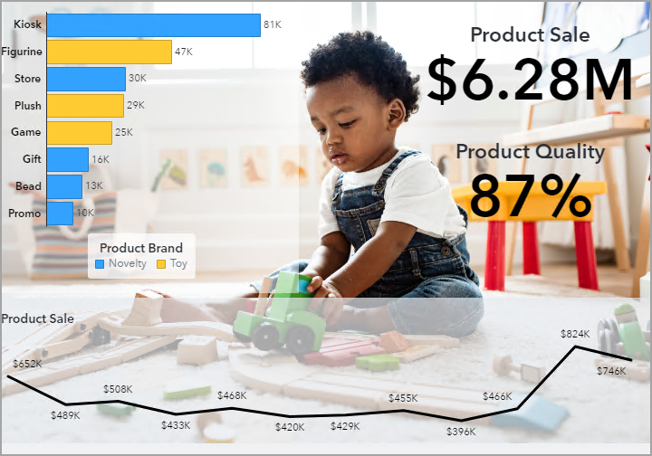
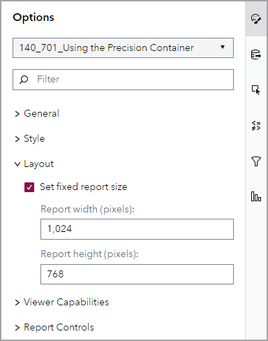
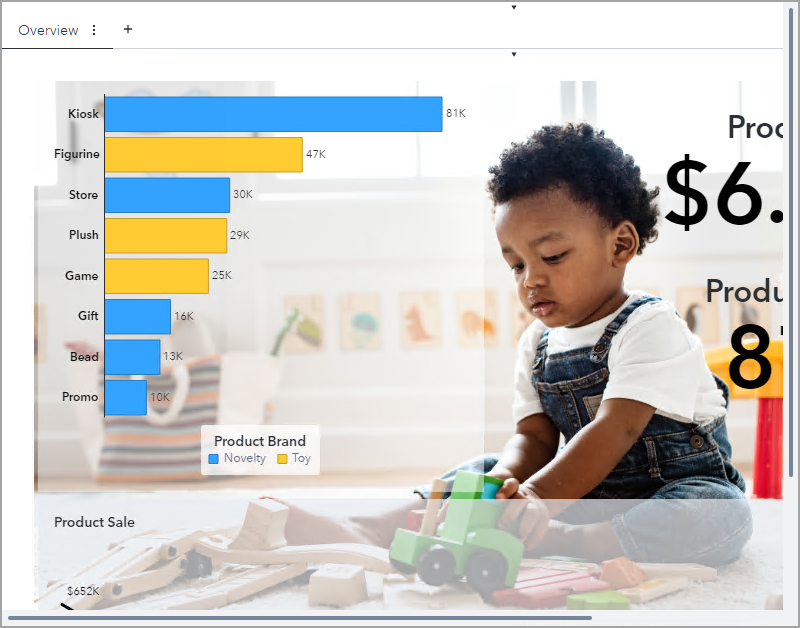
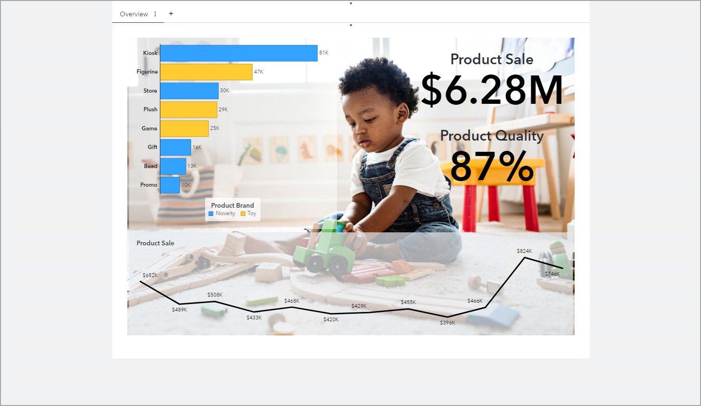

# Using the Precision Container
## Activity Duration
This activity will take 5 minutes to complete.

## Activity Objective

In this activity, you will view a report that uses the precision container.

## Open a Report

1. Open the **140_701_Using the Precision Container** report (located in the **SAS Content/Courses/VISUAL** folder) in edit mode.
   

   
Click to expand/collapse for solution

   **Solution:**
   1. On the desktop, double-click the **SAS Visual Analytics** icon.
   1. Enter the following:
      - User ID:  ***Designer***
      - Password: ***Student1*** (where 1 is the number one)
   1. Click **Sign in**.
   1. In the upper left corner, click the **Applications menu** button and select **Explore and Visualize**, if necessary.
   1. Navigate to **SAS Content/Courses/VISUAL** folder.
   1. Double-click the **140_701_Using the Precision Container** report to open it.
   1. Verify that you are editing the report.
   

   ## View the Report at Different Sizes

1. View the report using a small screen size and a large screen size.

   Does the report layout change?

   

   
Click to expand/collapse for solution

   **Solution:**
   1. Adjust the window to view the report on a small screen.

      

   1. Adjust the window to view the report on a large screen.

      

      Yes. The report layout adjusts depending on the screen size.

   

   ## Set the Report Size
1. At the report level, select the **Set fixed report size** option and set the report size to 1,024 pixels wide and 768 pixels tall.

   

   
Click to expand/collapse for solution

   **Solution:**
   1. In the right pane, click the **Options** button.
   1. In the drop-down list at the top of the Options pane, select **140_701_Using the Precision Container** (the report level).
   1. In the Layout group, select **Set fixed report size**.
   1. In the **Report width (pixels)** field, enter **1,024**.
   1. In the **Report height (pixels)** field, enter **768**.

      

      It's a best practice to use the **Set fixed report size** option with a precision container.

   

1. View the report using a small screen size and a large screen size.

   Does the report layout change?

   

   
Click to expand/collapse for solution

   **Solution:**
   1. Adjust the window to view the report on a small screen.

      

      Because the report size is fixed and the screen is smaller than the report, scrollbars appear on the left and bottom of the report.

   1. Adjust the window to view the report on a large screen.

      

      No. Because the report size is fixed, the report layout does not adjust.

   

