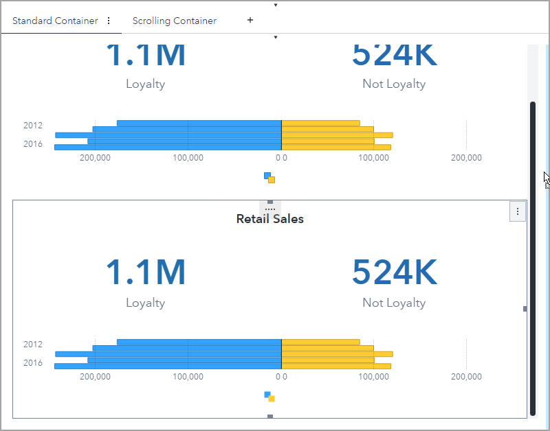
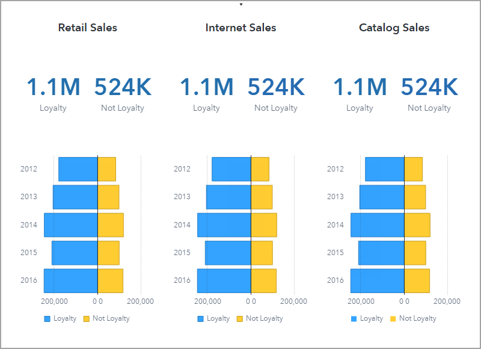
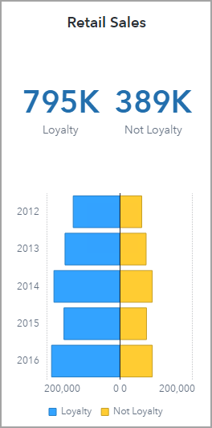
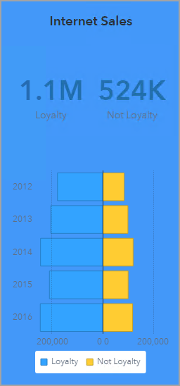
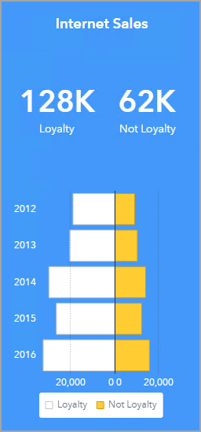
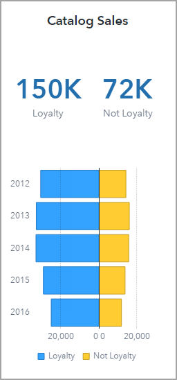
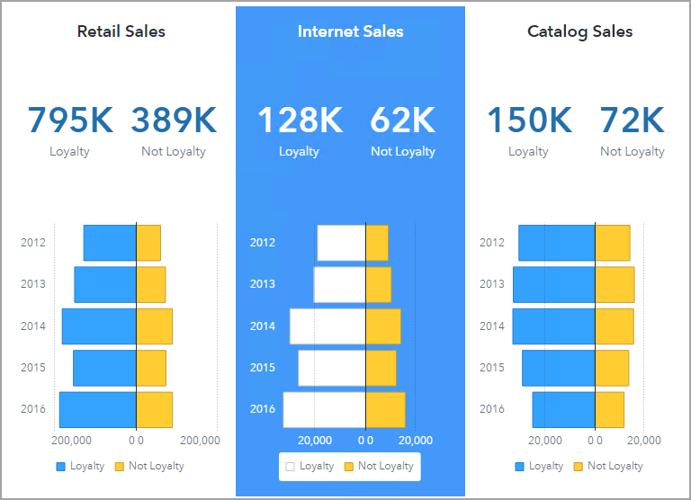
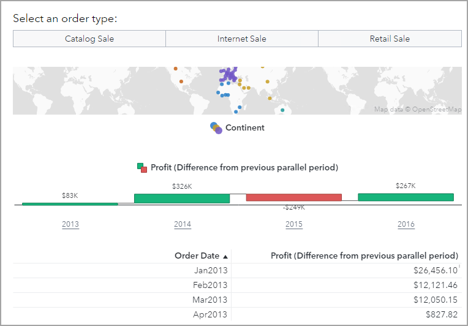
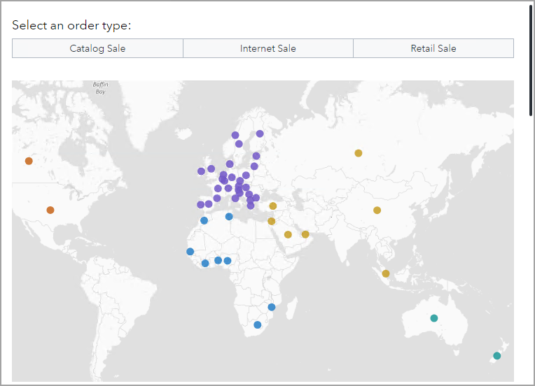

# Working with Standard and Scrolling Containers
## Demo Duration
This demo will take 10 minutes to complete.

## Demo Objective

In this demo, you use a standard container and a scrolling container in a report.

## Open an Existing Report

1. On the desktop, double-click the **SAS Visual Analytics** icon.
1. Enter the following:
    - User ID:  ***Designer***
    - Password: ***Student1*** (where 1 is the number one)
1. Click **Sign in**.

1. In the upper left corner, click the **Applications menu** button and select **Explore and Visualize**, if necessary.
1. Navigate to **SAS Content/Courses/VISUAL** folder.
1. Double-click the **140_702_Working with Standard and Scrolling Containers** report to open it.
1. Verify that you are editing the report.

   ## Create Three Standard Container Columns

1. Click the **Standard Container** tab, if necessary.
1. In the right pane, click the **Options** button.
1. In the drop-down list at the top of the Options pane, select **Retail Sales** (the standard container).
1. On the canvas, click the **Object menu** button for the standard container and select **Duplicate**.
1. Use the handlebar to move the copied container to the right side of the canvas.

    

1. On the Options pane, for the **Name** field, enter **Internet Sales**.
1. On the canvas, click the **Object menu** button for the standard container (labeled **Internet Sales**) and select **Duplicate**.
1. On the Options pane, for the **Name** field, enter **Catalog Sales**.
1. Double-click the text object in the center container.
1. Replace **Retail** with **Internet**.
1. Click **OK**.
1. Double-click the text object in the right container.
1. Replace **Retail** with **Catalog**.
1. Click **OK**.

    

   ## Modify Retail Sales Column

1. On the canvas, click the key value object in the Retail Sales column.
1. In the right pane, click the **Filters** button.
1. Select **New filter** > **Common Filter- Retail Sales**.

   A common filter that displays only Retail Sales orders is added to the key value object. These filters are available on the Data pane and can be dragged and dropped to an object to apply the filter.

1. On the canvas, click the butterfly chart in the Retail Sales Column.
1. On the Filters pane, select **New filter** > **Common Filter- Retail Sales**.

    

   ## Modify Internet Sales Column

1. In the right pane, click the **Options** button.
1. In the drop-down list at the top of the Options pane, select **Internet Sales** (the standard container).
1. In the Style group, select **Background**.
1. Click the **Select a color** button.
1. At the top of the window, click **Custom**.
1. In the **Hex value** field, enter **4398F9**.
1. Click **OK**.

    

    Next, we will modify the colors of the objects in the standard container so the text, values, and data can be seen.

1. Double-click the text object in the Internet Sales column.
1. Highlight the text.
1. On the font formatting toolbar, click the **Font Color** button and select **White**.
1. Click **OK**.
1. On the canvas, click the key value object in the Internet Sales column to select it.
1. On the Options pane, in the Key Value group, for the **Measure value**, click the **Select a color** button.
1. Select **White**.
1. For the **Lattice category value**, click the **Select a color** button.
1. Select **White**.
1. In the right pane, click the **Filters** button.
1. Select **New filter** > **Common Filter- Internet Sales**.

1. On the canvas, click the butterfly chart in the Internet Sales column to select it.
1. On the Filters pane, select **New filter** > **Common Filter- Internet Sales**.
1. In the right pane, click the **Options** button.
1. In the Style group, for the **Fill**, click the first **Select a color** button.
1. Select **White**.
1. In the X Axis Options group, for the **Tick values**, click the **Select a color** button.
1. Select **White**.
1. In the Y Axis Options group, for the **Tick values**, click the **Select a color** button.
1. Select **White**.

    

   ## Modify Catalog Sales Column

1. On the canvas, click the key value object in the Catalog Sales column.
1. In the right pane, click the **Filters** button.
1. Select **New filter** > **Common Filter- Catalog Sales**.

1. On the canvas, click the butterfly chart in the Catalog Sales Column.
1. On the Filters pane, select **New filter** > **Common Filter- Catalog Sales**.

    

    The Standard Container page should resemble the following:

    

   ## Use a Scrolling Container

1. Click the **Scrolling Container** tab.

    

   This page uses a standard container to display the content. Notice how all objects are resized to fit in the content area.

1. In the right pane, click the **Options** button.
1. In the drop-down list at the top of the Options pane, select **Order Analysis** (the standard container).
1. In the Layout group, clear **Avoid scrollbars**.

   The content in the standard container is resized and a scrollbar is added to the left side of the container. You can now view objects at a larger size and scroll to view additional objects.

    

1. In the upper right corner, click the **Save** button.
1. In the upper right corner, click the **More** button and select **Close**.
